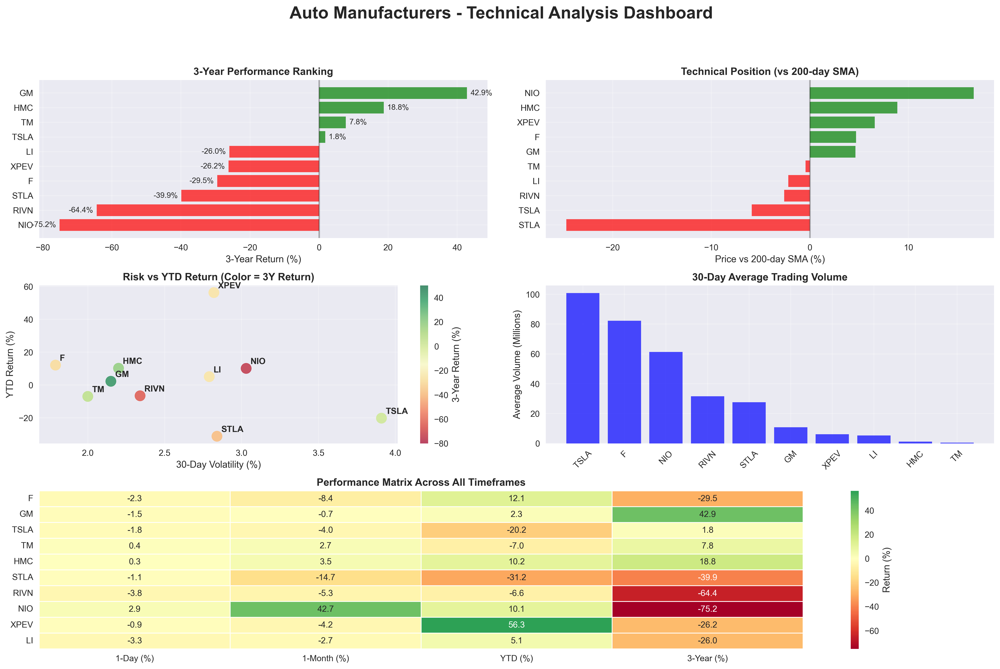
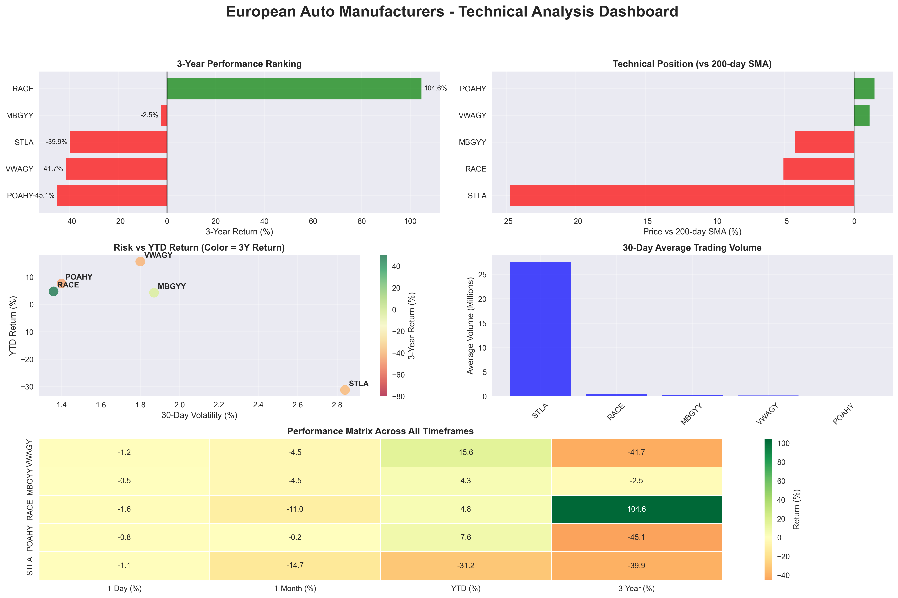

[July 2025 Update](reports/july_2025.md)

## August 2025 Update

### ***The Art of The Deal?***

Now that the August 1st deadline is over, it will take several days to re-program the systems with the new tariff rules. Since Trump relies on chaos and volatility as a tool for his game, it is likely that during the upcoming days there could be exceptions to these new rules. Many of the 15% tarrifs will only begin applying on August 8th. Pre-transit shipments will be exempt from the tariffs (pay old rate) until October 5th.

**US - Japan**: 

Unlike the Europeans, the Japanese engaged with the Trump administration early on and got better off if not better. 
Under this 'deal', the Japs committ ~$550b in US investments and purchases (Boeing and agriculture**). In reality, only a silver of that money will take the form of straight equity injections (1 to 2%)- most of it is structured as loans (98 to 99%), loan guarantees and other credit facilities routed through the Japan Bank for International Cooperation (JBIC) and Nippon Export and Investment Insurance (NEXI).

By using JBIC|NEXI-backed debt instruments, Tokyo can claim a huge investment without havingm to deploy government balance-sheet capital directly. This huge Jap investment is actually credit support/loans to Japanse and selected foreign companies investing in US projects (they can borrow more cheaply and with the backing of the Japanese government)

Thanks to this art of the deal, US automakers are losing big. The Detroit 3 (GM, Ford, Stellantis) are facing a combined $7 Billion drag on earnings in 2025. The Japan deal won't likely trigger significant on-shoring of production (nothing will).

- [More plots](schwab_realtime_data/auto_industry)

- [Auto Industry report summary](schwab_realtime_data/auto_industry/auto_report.md)

** Japan is reducing or eliminating tariffs on ~600 agricultural tariff lines (beef, portk, cheese, and expanding quotas for products like wheat)

**US - EU**: 

While promoting his golf club in Scottland, president Trump and EU president von der Leyen agreed to a 15% tarriff on European cars and parts (down from the threat of 27.5%) while the EU agreed to lower its duty on US-made autos from 10% to 2.5%. This assymetry favors the US auto industry and could chip away at EU export volumes and profit margins over time.

Features of the deal include:

- Tariff on most of EU exports (cars, semiconductors, pharmaceuticals)
- Exception for aircrafts and component parts
- Continuation of 50% tariff on steel and aluminum

- [More plots](schwab_realtime_data/EU_auto)

- [EU Automakers report summary](schwab_realtime_data/EU_auto/EU_auto.md)

## Disclaimer

This project and its contents are provided for informational and educational purposes only. They do not constitute financial, investment, or legal advice. Any decisions made based on the information presented here are solely at your own risk.
