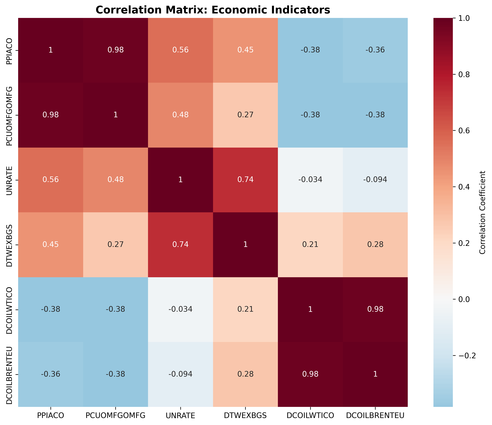

As the August 1st deadline approaches, capacity constraints of ports are worsening and will continue to if a deal is not reached before the deadline. Market participants are looking for stability regardless of the outcome.

| Rank | European port (UN LOCODE) | Direct strings / week to US* | 12-month US-bound export tonnage (Mt) | YoY change | Latest CAx (wk 27 ’25) |
|------|---------------------------|------------------------------|---------------------------------------|------------|------------------------|
| 1 | **Rotterdam (NLRTM)**       | 11 | **27.6** | **▲ 11 %** | **0.83** |
| 2 | **Antwerp-Bruges (BEANR)**  | 9  | 22.9     | ▲ 5 %  | 0.79 |
| 3 | **Hamburg (DEHAM)**         | 6  | 17.3     | ▲ 9 %  | 0.81 |
| 4 | Valencia (ESVLC)            | 4  | 11.8     | ▲ 14 % | 0.68 |
| 5 | Gioia Tauro (ITGIT)         | 3  | 9.4      | **▲ 15 %** | 0.65 |
| 6 | Le Havre (FRLEH)            | 3  | 7.0      | ▲ 7 %  | 0.71 |
| 7 | Bremerhaven (DEBRV)         | 2  | 6.1      | ▲ 6 %  | 0.77 |

*Direct-string count = weekly scheduled sailings shown in SeaRates API, corroborated with UNCTAD LSBCI “0 trans-shipments” flag.

- ***Northern-range*** hubs are the pressure-valve. Rotterdam, Antwerp-Bruges and Hamburg together handled over half (≈68 Mt) of all US-destined European exports over the past year
- ***Inventory is sitting quayside*** CAxs readings in 0.8 range mean 20-30% more full boxes are entering than leaving, a clear backlog signal. Cargo waiting on the pier
- ***Mediterranean*** trans-shipment hubs (Gioia Tauro, Algeciras) are quietly stockpiling. The Gioia Tauro jump (▲ 15 %) is the steepest of any EU port with a direct US string

Unlike 2018, exporters are waiting. PortWatch tallies show spikes in import calls (boxes arriving from inland depots) but only a shallow uptick in laden sailing to the US → Park and Wait behaviour.

Rotterdam’s US-bound tonnage ▲ 11 % YoY but direct sailings stuck at 11/week → higher load factors and longer dwell times. Storage yards at RWG|ECT (Rotterderdam) and CTA|EUROGATE (Hamburg) are getting close to COVID-era utilization levels. Storage fees and yard handling account for >30% of Rotterdam's non-marine revenue, up from 18% pre-tariff-talks. 

The stockpiling in the south of Europe indicates hedging by carriers. If tariffs bite, then cargo can be rerouted to Latin America or West Africa with one trans-shipment (The spice must flow).

***America's blood vessels are choking but how is she doing?***

Inflation is still above Fed's target, and tariffs are adding more pressure.

Growth is still solid, strong, and fiscal policy is expansionary.
The Fed sees 2025 GPD way above potential and unemployment at < 4.5%.
Fed Chair Jerome Powell, therefore, still holds a hawkish stance depite political pressure from President Trump for faster cuts.
From Trumps view, rate cuts will boost consumption and business investment, cheapen Federal debt service, weaken the dollar to help exports. History shows that politicizing monetary policy can actually raise long-term yields by unsettleing investors, a quintessential example would be Turkey 2019 and beyond.

<!-- 1. Fiscal stance -->

| Indicator | FY 2025 | Info |
|--------|---------------|---------|
| **Headline deficit** | **$1.9 trn** ≙ **6.1 % of GDP** | CBO January baseline; barely any changed after the June tax-and-spend bill |
| **Primary deficit** (ex-interest) | ≈ 4 % of GDP | Outlays keep outrunning revenues despite solid growth |
| **Net-interest outlays** | **+$55 bn YoY** (Oct – Jun) | Fastest-growing line item (↑ 8 %) |

---

A lot of money is being allocated to paying interest rates on bonds

Some of the variables that maintain the expansionary fiscal policy are:

- One Big Beautiful Bill Act, adding ~$3 trn to the 10 year deficit
- Higher denfense and entitlement spending (a lot for defense was appropriated from Biden's inflation bill)
- Rising debt-service bill as the stock of debt rolls over ar 4-5% coupon rates

....

To be continued...

