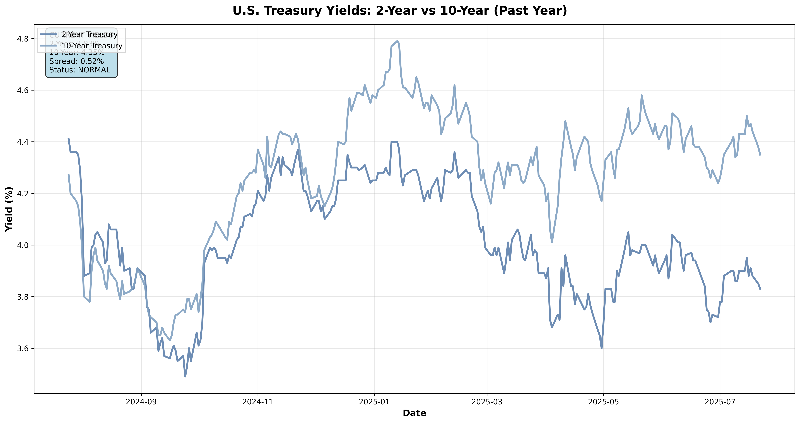

## July 2025 Update

As the August 1st deadline approaches, capacity constraints of ports are worsening and will continue to if a deal is not reached before the deadline. Market participants are looking for stability regardless of the outcome.

| Rank | European port (UN LOCODE) | Direct strings / week to US* | 12-month US-bound export tonnage (Mt) | YoY change | Latest CAx (wk 27 ’25) |
|------|---------------------------|------------------------------|---------------------------------------|------------|------------------------|
| 1 | **Rotterdam (NLRTM)**       | 11 | **27.6** | **▲ 11 %** | **0.83** |
| 2 | **Antwerp-Bruges (BEANR)**  | 9  | 22.9     | ▲ 5 %  | 0.79 |
| 3 | **Hamburg (DEHAM)**         | 6  | 17.3     | ▲ 9 %  | 0.81 |
| 4 | Valencia (ESVLC)            | 4  | 11.8     | ▲ 14 % | 0.68 |
| 5 | Gioia Tauro (ITGIT)         | 3  | 9.4      | **▲ 15 %** | 0.65 |
| 6 | Le Havre (FRLEH)            | 3  | 7.0      | ▲ 7 %  | 0.71 |
| 7 | Bremerhaven (DEBRV)         | 2  | 6.1      | ▲ 6 %  | 0.77 |

*Direct-string count = weekly scheduled sailings shown in SeaRates API, corroborated with UNCTAD LSBCI “0 trans-shipments” flag.

- ***Northern-range*** hubs are the pressure-valve. Rotterdam, Antwerp-Bruges and Hamburg together handled over half (≈68 Mt) of all US-destined European exports over the past year
- ***Inventory is sitting quayside*** CAxs readings in 0.8 range mean 20-30% more full boxes are entering than leaving, a clear backlog signal. Cargo waiting on the pier
- ***Mediterranean*** trans-shipment hubs (Gioia Tauro, Algeciras) are quietly stockpiling. The Gioia Tauro jump (▲ 15 %) is the steepest of any EU port with a direct US string

Unlike 2018, exporters are waiting. PortWatch tallies show spikes in import calls (boxes arriving from inland depots) but only a shallow uptick in laden sailing to the US → Park and Wait behaviour.

Rotterdam’s US-bound tonnage ▲ 11 % YoY but direct sailings stuck at 11/week → higher load factors and longer dwell times. Storage yards at RWG|ECT (Rotterdam) and CTA|EUROGATE (Hamburg) are getting close to COVID-era utilization levels. Storage fees and yard handling account for >30% of Rotterdam's non-marine revenue, up from 18% pre-tariff-talks. 

The stockpiling in the south of Europe indicates hedging by carriers. If tariffs bite, then cargo can be rerouted to Latin America or West Africa with one trans-shipment.

***America's blood vessels are choking but how is she doing?***

Inflation is still above Fed's target, and tariffs are adding more pressure.

Growth is still solid, strong, and fiscal policy is expansionary.
The Fed sees 2025 GPD way above potential and unemployment at < 4.5%.
Fed Chair Jerome Powell, therefore, still holds a hawkish stance depite political pressure from President Trump for faster cuts.
From Trumps view, rate cuts will boost consumption and business investment, cheapen Federal debt service, weaken the dollar to help exports. History shows that politicizing monetary policy can actually raise long-term yields by unsettleing investors, a quintessential example would be Turkey 2019.

<!-- 1. Fiscal stance -->

| Indicator | FY 2025 | Info |
|--------|---------------|---------|
| **Headline deficit** | **$1.9 trn** ≙ **6.1 % of GDP** | CBO January baseline; barely any changed after the June tax-and-spend bill |
| **Primary deficit** (ex-interest) | ≈ 4 % of GDP | Outlays keep outrunning revenues despite solid growth |
| **Net-interest outlays** | **+$55 bn YoY** (Oct – Jun) | Fastest-growing line item (↑ 8 %) |

---

A lot of money is being allocated to paying interest rates on bonds

Some of the variables contributing to the expansionary fiscal policy are:

- One Big Beautiful Bill Act, adding ~$3 trn to the 10 year deficit
- Higher denfense and entitlement spending (a lot for defense was appropriated from Biden's inflation bill)
- Rising debt-service bill as the stock of debt rolls over at 4-5% coupon rates

***Bull steepener move***: Cuts priced at front end; long end anchored 

Since Fed policy sets the floor for what bankls must pay on sitcky vs. flighty deposits, higher-for-longer keeps funding costs elevated; cuts compress asset yields faster than deposit costs fall → Banks are paying more to attract and retain deposits, especially flighty ones, to compete with other investment options. if the Fed were to cut rates, those asset yields might fall faster which could potentially squeeze profit margins.

**Tariffs** = cost push + uncertainty: 10% “baseline” tariffs plus higher country-specific levies raise import costs, pressure margins for clients, and spur hedging—good for trading, mixed for credit

**Almighty Dollar**

Despite high nominal rates the greenback softens: 

- Futures price −75 bp in Fed easing by mid-2026; CPI still ~3 % → real 2-y rate advantage vs. Europe/Japan has shrunk 120 bp since Jan. A currency trades on expected, not current, carry
- Budget gap ≈ 6 %-of-GDP; monthly bill/Note auctions top $330 bn.  Current-account still −3 %-of-GDP.Foreign investors demand greater FX hedge or higher term-premium, diluting rate support
- Moody’s cut of US sovereign, tariff volatility, talk of firing the Fed chair → raises risk side of USD assets, pushes buyers to hedge
- ECB and BoJ have lifted policy rates/terminated YCC; 3-mth EUR-USD rate gap narrowed from 210 bp → 110 bp in a year.  Carry pick-up is no longer decisive
- Asia’s official & private investors (>$46 tn overseas) are trimming incremental USD buys, raising hedge ratios on existing stock.  Less unhedged inflow dampens bid for dollars
- Broad 10 % tariff cuts US goods import demand mechanically reducing FX demand for dollars to pay foreign suppliers, while retaliation hurts exports
- Weaker USD reflates oil/metals → lifts US inflation expectations → anchors Fed from hiking further; also recycles petrodollars into non-USD assets when OPEC sells crude and diversifies
- With no acute global crisis and US growth slowing (NY Fed nowcasts <1 %), demand for “USD cash” as the ultimate hedge is muted

## Disclaimer

This project and its contents are provided for informational and educational purposes only. They do not constitute financial, investment, or legal advice. Any decisions made based on the information presented here are solely at your own risk.
